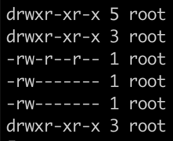

### terminal查看文件数


```shell
ls -l|grep "^-"|wc -l
```

Ls -l显示文件详细信息，在文件详细信息首部是文件类型和权限信息，`-`表示是文件，`d`表示是文件夹



这里我们统计`-`的个数就可以知道文件个数。

同时我们使用grep命令正则匹配`-`，`^`表示匹配开头，以`-`开头即为文件

然后用wc命令查看一下行数 -l

OK